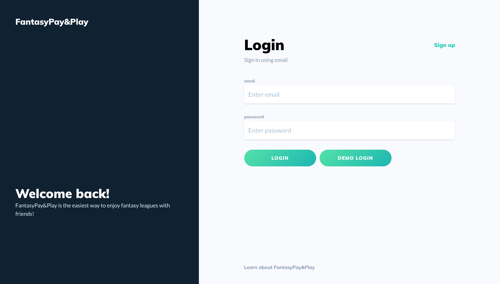
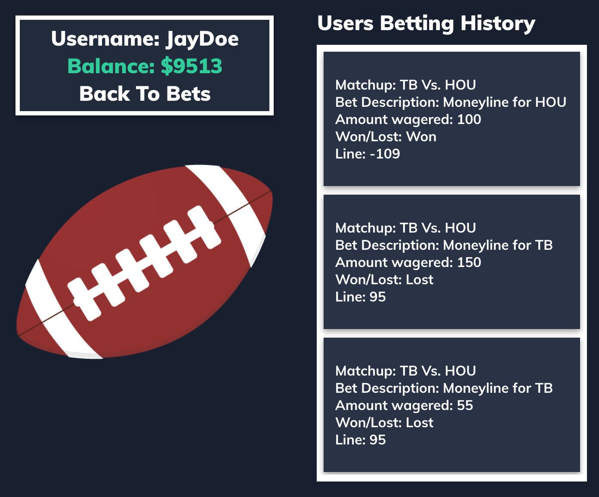

# FantasyPay&Play
# [Live Demo](https://fantasypayandplay.herokuapp.com/#/)


# Features & Technical Challenges

Constructed User Auth by sending 

Integrated IEX (Third Party) API by sending an HTTP query with a secured API key for real-time U.S. stock market data

Created User Portfolio Dashboard that updates off of our Redux stores state
User Watchlist - Users can add companies to a watchlist so that they can track specific companies that interest them
Company Profile - Users can see detailed information about an individual company, including detailed financial information and stats. Users can also buy, sell, and watch stocks from this page
Buying/Selling Shares - Users are able to purchase and sell company shares. Their balance and portoflio both update in real time alongside their trading decisions
Search - Users can get instant live search results of company symbols as they are typing the company name or symbol

Employed Docker container tooling to ensure code is shipped reliably across all platforms

## Sports Betting

Screenshot 1 (Betting Page)
Screenshot 2 (Betting Code)

Screenshot 3 (User Profile)
Screenshot 4 (User Profile Code)

## Fantasy Football

Screenshot 1 (Leagues -- Schedule & Draft)
Screenshot 2 (Schedule Code)
Screenshot 3 (Draft Code)

Screenshot 4 (Team Page)
Screenshot 5 (Team Page Code)

FantasyPay&Play is a fantasy football and sports betting website. It incorporates two major football fandom passtimes through a simple football fantasy league and a football betting client, which uses a starting stipend of "money" for fun cost-free betting

## Features and Technical Challenges

### Player Models
* Player Data drawn from 4 api calls to bring in season, weekly, projected Season, and projected weekly stats
```javascript
//mutations.js
createAllPlayers: {
      type: new GraphQLList(PlayerType),
      resolve() {
        const promiseArr = [];
        const allPlayers = {};

        promiseArr.push(
          axios(seasonStats).then(res => {
            let seasonStatsArr = res.data;
            sortJsonArray(seasonStatsArr, "PlayerID");
            seasonStatsArr.forEach(player => {
```
* Player data is assembled into the Player model after the promiseArr has saved all of the intermediate data
* Nested Promise Arrays used to secure data, and force all actions to complete and models to save in order
```javascript
//after assembling all data from 4 ApiCalls
return Promise.all(promiseArr).then(() => {
          let promiseArr = [];
          Object.values(allPlayers).forEach(player => {
            promiseArr.push(
              new Player({
                name: player.name,
                team: player.team,
                position: player.position,
                IsGameOver: player.isGameOver,

                weeklyPassingAttempts: player.weeklyPassingAttempts,
                weeklyPassingCompletions: player.weeklyPassingCompletions,
		etc….
```
* Large/Unified player model allows for quick transitions and filtering of player table on the frontend


### State based content display


The main content is displayed using the side bar's state of the mainComponent
```javascript
  const [main, setMain] = useState({
    mainComponent: BetsIndex, //default selected component
    props: null
  });
  const changeMain = (mainComponent, props) => (
    setMain(main => ({ ...main, mainComponent, props }))
  );
```
This is possible by sending the changeMain function down as a prop to the sidebar and their items, and the component currently displayed as seen from the main page component
```javascript
  return (
    <div className="main-page">
      <div className="sidebar-container">
        <Nav onAppPage={true} />
        <SideBar changeMain={changeMain} /> //each sidebar item will use changeMain when clicked
      </div>
      <div className="main-content">
        <main.mainComponent {...main.props} changeMain={changeMain} /> //the component displayed is taken from main state
      </div>
      <div className="right-sidebar"></div>
    </div>
  );
```
### Cron-Jobs
Because this site uses real-world data based off of the NFL, the data for bets and fantasy leagues needs to be updated. In order to accomplish this we used cron-jobs to update bets and players on a weekly basis. 
```javascript
//index.js
cron.schedule(“59 23 * * 3”, function() {
      const nflStart = new Date("September 3, 2019 00:20:18");
      let parsedStart = Date.parse(nflStart);
      const nflEnd = new Date("December 30, 2019 00:20:18");
      let parsedEnd = Date.parse(nflEnd);
      let date = Date.now();
      if ( date >= parsedStart && date <= parsedEnd){
        let i = 0;
        while((parsedStart + (i*604800000)) < date){
          i++
        }
	week = i;
        year = nflStart.getFullYear();
  // later on in the cron-block
       client
          .mutate({
            mutation: CREATE_ALL_BETS,
            variables: {
              url:
                `https://api.sportsdata.io/v3/nfl/odds/json/GameOddsByWeek/${year}/${week}`
            }
          })
          .then(({ data }) => {
            console.log(data);
          });
      }
    });
```
* Allows for real-life feedback, when player stats and bets update weekly in acccordance to the weekly NFL games
* Updates on Wednesday nights to avoid overlapping with NFL games
* Bets, Players, and Userbet models all have functions to update them weekly



## Upcoming Additions
- [ ] League Chat(Transaction Log)
- [ ] Player News


