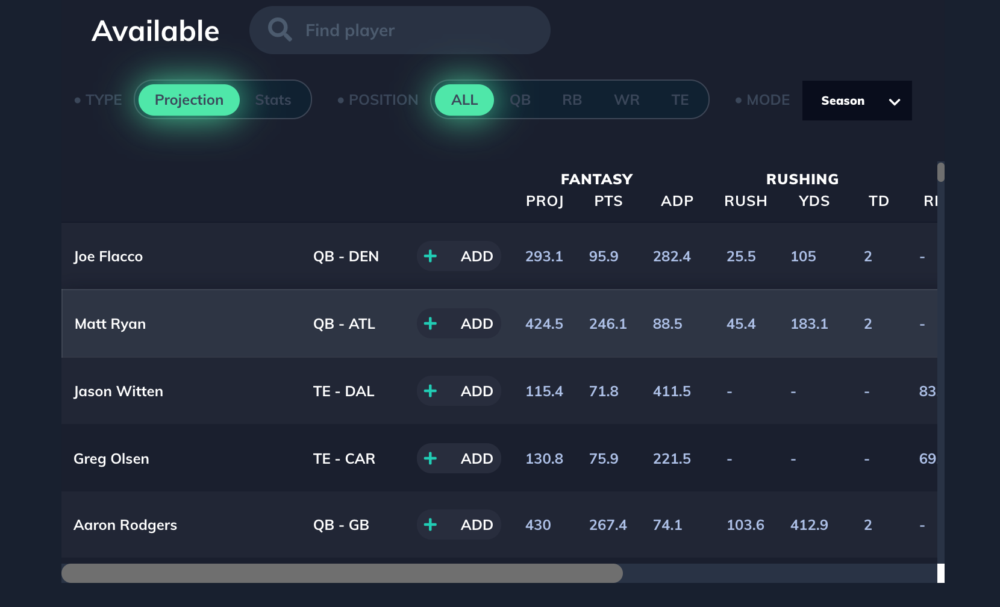
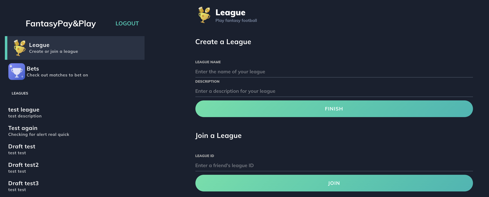
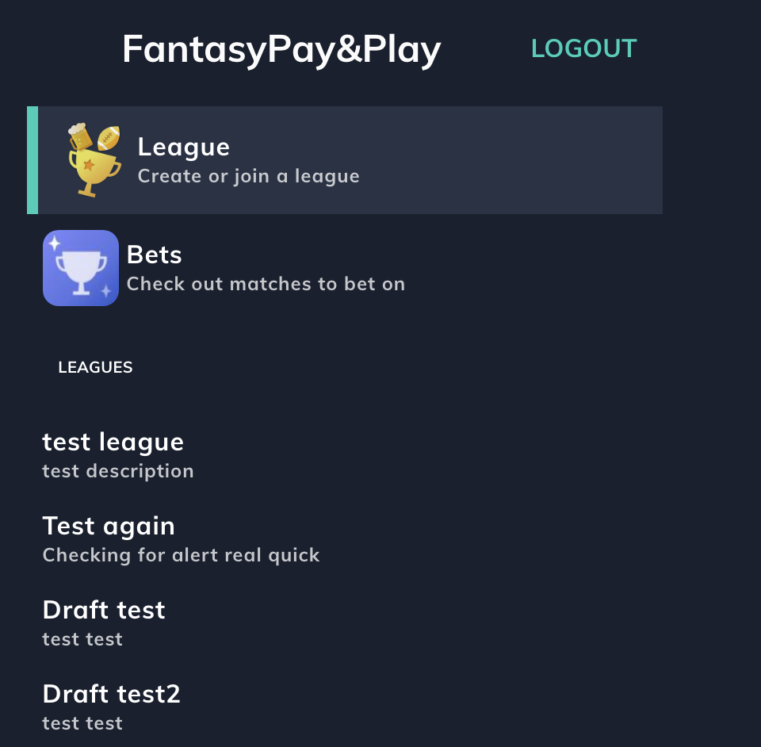

# FantasyPay&Play(WIP)
# [Live Demo](https://fantasypayandplay.herokuapp.com/#/)


## Technologies
 * Backend: MongoDB, Express, Express / GraphQL, and Node.js (MERN)
 * Frontend: JavaScript, React, Redux, Apollo / GraphQL
 * FantasyAPI/BettingAPI(https://sportsdata.io/developers/api-documentation/nfl#/fantasy)

## Background and Overview

FantasyPay&Play is a fantasy football and sports betting website. It incorporates two major football fandom passtimes through a football fantasy league clone and a simple money-line sports betting client

## Features and Technical Challenges

### Player Models
* Player Data drawn from 4 api calls to bring in season, weekly, projected Season, and projected weekly stats
```javascript
//mutations.js
createAllPlayers: {
      type: new GraphQLList(PlayerType),
      resolve() {
        const promiseArr = [];
        const allPlayers = {};

        promiseArr.push(
          axios(seasonStats).then(res => {
            let seasonStatsArr = res.data;
            sortJsonArray(seasonStatsArr, "PlayerID");
            seasonStatsArr.forEach(player => {
```
* Player data is assembled into the Player model after the promiseArr has saved all of the intermediate data
* Nested Promise Arrays used to secure data, and force all actions to complete and models to save in order
```javascript
 //after assembling all data from 4 ApiCalls
return Promise.all(promiseArr).then(() => {
          let promiseArr = [];
          Object.values(allPlayers).forEach(player => {
            promiseArr.push(
              new Player({
                name: player.name,
                team: player.team,
                position: player.position,
                IsGameOver: player.isGameOver,

                weeklyPassingAttempts: player.weeklyPassingAttempts,
                weeklyPassingCompletions: player.weeklyPassingCompletions,
		etc….
```
This large player model allows for quick transitions of different data types in a smooth player table on the frontend

### State based content display





The main content is displayed using the side bar's state of the mainComponent
```javascript
  const [main, setMain] = useState({
    mainComponent: BetsIndex, //default selected component
    props: null
  });
  const changeMain = (mainComponent, props) => (
    setMain(main => ({ ...main, mainComponent, props }))
  );
```
This is possible by sending the changeMain function down as a prop to the sidebar and their items, and the component currently displayed as seen from the main page component
```javascript
  return (
    <div className="main-page">
      <div className="sidebar-container">
        <Nav onAppPage={true} />
        <SideBar changeMain={changeMain} /> //each sidebar item will use changeMain when clicked
      </div>
      <div className="main-content">
        <main.mainComponent {...main.props} changeMain={changeMain} /> //the component displayed is taken from main state
      </div>
      <div className="right-sidebar"></div>
    </div>
  );
```


## Upcoming Additions
- [ ] League Chat(Transaction Log)
- [ ] Player News


